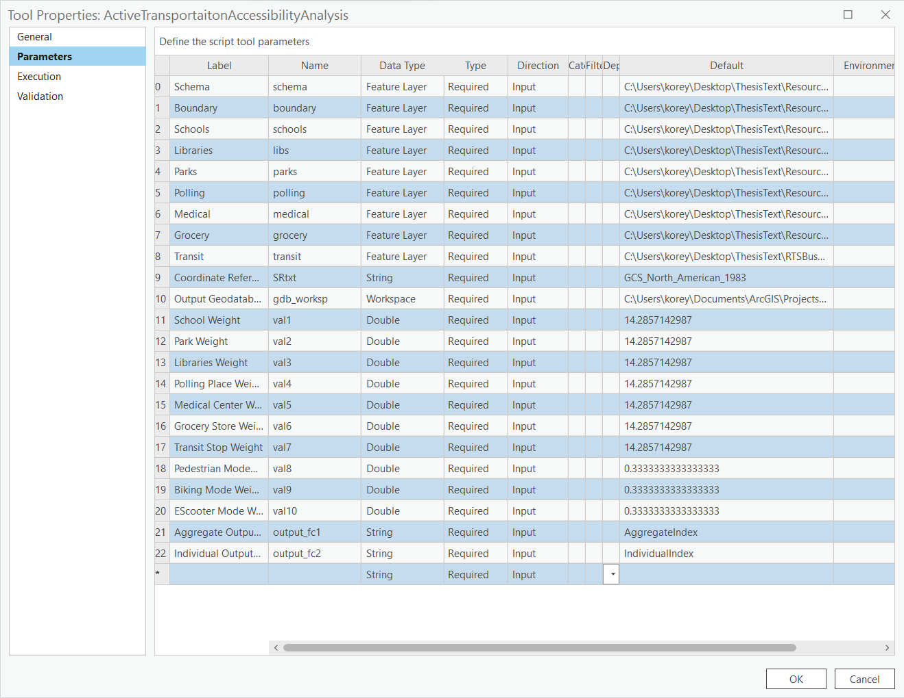
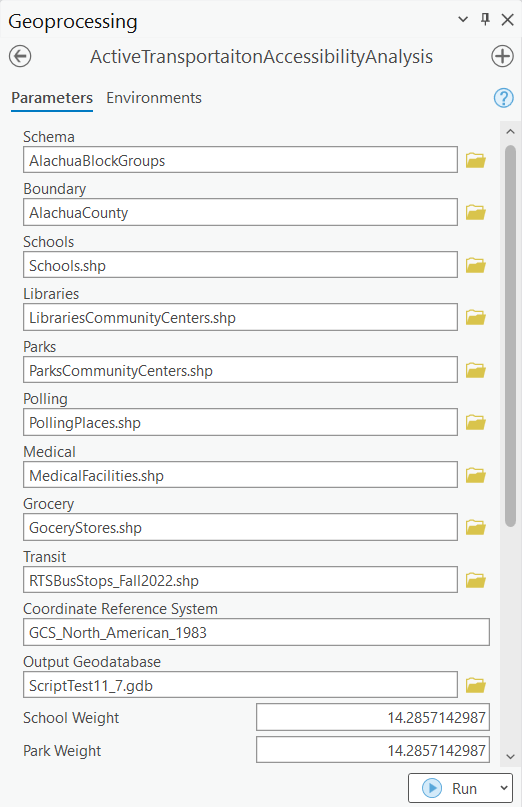
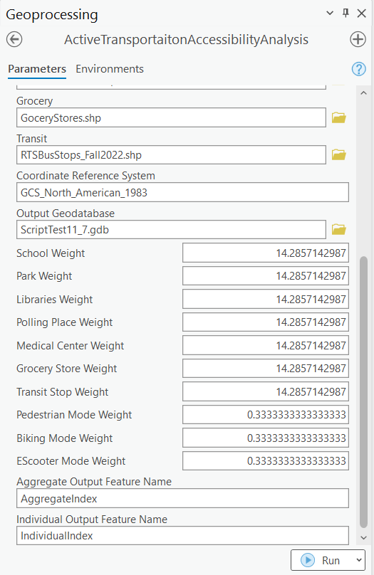

# The Just 15-Minute City Tool

The Just 15-Minute City Tool is an ArcGIS Script Tool that measures the ability of different locations in a community to access community resources. The tool creates a 15-minute radius of walking, cycling, and e-scooter-ing and creates an aggregate accessibility score for each section of the study area. 

This tool uses Fainstein's Just City framework and the idea of a 15-minute city to understand who has access to these resources, and can they get to them in 15-minutes without owning a vehicle.

## 1. Description

The tool is based on the following model 

## 2. Tool Set Up

- Download the 'Just_15_Minute_City_Tool.py' file
- Open a new ArcGIS pro project
- In the project toolbox right click and add new script to toolbox
- In execution, navigate to this script file and select it

## 3. Parameters

Parameters must be defined to create the GUI.

Copy the format of this image

- Parameter 0 is the scale of operation
- Parameter 1 sets the boundary
- Parameters 2-8 set the points of the community resources
- Parameter 9 sets the he coordinate reference system
- Parameter 10 dictates the workspace of the tool
- Parameters 11-17 set the weights for each community resource
- Parameters 18-20 set the weights for each mode for the aggregate analysis
- The last two set the names of the outputs

## 4. GUI

Properly installed gUI will look like this

